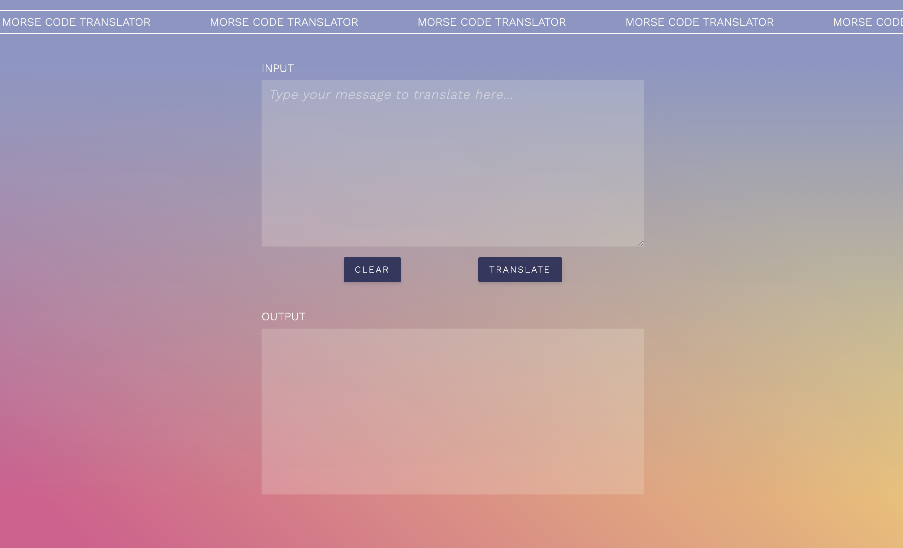

# Morse Code Translator

> _To create a morse code translator using OOP. The classes used should store all the information needed to translate between Morse code and English (and back again) including alphabets, the word to translate and the eventual output._ </br>

#### Project Link [_here_](https://amiehannah.github.io/morse-code-translator/).

##



## User Story:

- As a user of this translator, I want to be able to translate content from one language to another, so that I am able to communicate effectively.
- Given that the user clicks on the translate button and there is **_English_** content typed into the input box, the input values should be translated to the **_Morse Code_** equivalent and displayed back to the user in the output box.
- Given that the user clicks on the translate button and there is **_Morse Code_** content typed into the input box, the input values should be translated to the **_English_** equivalent and displayed back to the user in the output box.
- Given that the user clicks on the reset button, this output display should reset and clear, ready to be used again.

## Functionality:

1. Stored the alphabets (english and morse code) in objects, with key value pairs.

```javascript
const alphabet = {
  a: ".-",
  b: "-...",
  c: "-.-.",
};
```

```javascript
const morseAlphabet = {
  ".-": "a",
  "-...": "b",
  "-.-.": "c",
```

2. Created a class of Translator, binding the alphabets to the class.

```javascript
class Translator {
  constructor() {
    (this.alphabet = alphabet),
      (this.morseAlphabet = morseAlphabet),
      (this.translationArr = []),
      (this.translation = ""),
      (this.output = ""),
      (this.wordToTranslate = "");
  }
  // Methods here for each step of the translation
}
```

3. Created methods for each step of the translation, firstly returning the users input.
4. Next breaking down the input, turning it into an array to enable the input to be looped over during the translate method.
5. The Translate input method, uses map() to iterate over the translation array and returns the values from the alphabet object. If the input contains a space (i.e. between words) return/replace it with a '/' which is commonly seen in Morse Code.
6. Display the translation in the output box.
7. This is all triggered by the click event taking place on the 'Translate' button, which creates a new instance of the Translator class and triggers a sequence of methods on the class.
8. Once I had the English to Morse functionality working, I then wanted to be able to translate a Morse input back to English.
9. By extending the Translator class it allows the MorseToEnglish class to inherit any properties and methods from the parent class that could be reused.

```javascript
class MorseToEnglish extends Translator {
  constructor() {
    super();
  }
  // Methods here to translate Morse Code to English
}
```

10. I had to add a few unique methods to the MorseToEnglish class as breaking down the morse input required different steps, as did translating the input.
11. Finally in the 'Translate' button event listener I added a regular expression </br>
    `const checkInputRegEx = /[^\s0-9a-zA-Z'\/(,:;&?!)-\.{3,}]/gm;` </br>
    and if statement to validate the input, searching for the correct character combinations in the input string and triggering either an English or Morse translation based on the input characters.

## Technologies & Features:

- JavaScript
- OOP approach
- Unit Tested using Jest
- HTML5
- SCSS
- Mobile first / responsive design
- Git Version Control
- UI - features textured gradient mesh background I created in Adobe Illustrator and horizontal ticker to the top of the page.

## Unit Testing: <br/>

- I added unit testing to check the methods on the class of Translator.
- I've written tests to check if my translator could successfully translate: _characters_, _words_ and _sentences_.
- My initial code was then refactored to enable it to handle some basic punctuation and numerical values 0-9, as my test initially revealed that these hadn't been accounted for.

## Further Developments:

- Extend the classes to be able to translate other languages.
- Format the text outputs, ensuring that capitalised values are structured after every full stop and that values such as 'I' are capitalised etc.
- Aim to improve writing the methods/functions on the class, with the intention of making them more 'pure'.

## Contact

Created by [Amie Edwards](mailto:amie.edwards17@gmail.com)

<br/>
<div align="right">
    <b><a href="#morse-code-translator"> ^ back to top</a></b>
</div>
<br/>
